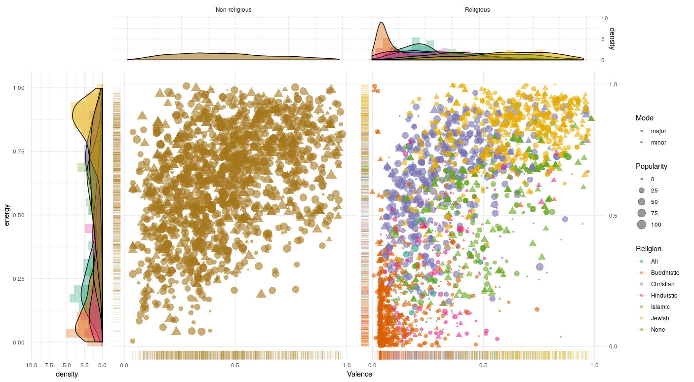

# Computational Musicology
#### _What makes music religious?_

Github Page of the repository for the 2019 Computational Musicology course at the UvA

---

## Introduction
Music has been around since the history of mankind. However, where most of today's music tends to be used for personal entertainment, it was often used to give praise to deities. But are there any musicological properties of a piece of music that make it specifically suitable for religious purpouses? Bach himself sometimes re-used his 'pagan' music for religious purposes and vice versa giving an important role to lyrics. However, we also know that Bach was a master in the writing of baroque [affective](https://en.wikipedia.org/wiki/Doctrine_of_the_affections) music, indicating a carefull use of pitch, volume, tibre, and time for bringing music to it's purposes. So, even if there is some overlap between musical sound of pagan en religious music, there might be some aspects which fit just better for one of them.

## Method
To be able to answer the research question one has to compare religious music with
non-religious music. This is implemented in `R` using the `spotifyr` module which gathers data from two types of playlists: _religious_ and _non-religious_. Both corpuses are more usefull for machine learning purposes, as for example classification, if they contain many songs. Therefore, a set of different playlists which tend to be typically religious or non-religious has been made. Depending on the results, the religious playlists could be split up further to detect if there are any difference between different religions. Differences are measured between contemporary music lists but could be further expanded to more classical oriented music. Both sets are mostly biased with so called _top_-songs.

####  Religious Playlists
<table>
    <tr>
        <th>Title</th>
        <th>ID</th>
        <th>Songs</th>
    </tr>
    <tr>
        <td>Religious</td>
        <td>1Lfv5hpiBqtxHIlaeUo8TS</td>
        <td>44</td>
    </tr>
    <tr>
        <td>Top Christian Contemporary</td>
        <td>37i9dQZF1DWUileP28ODwg</td>
        <td>58</td>
    </tr>
    <tr>
        <td>Top Christian</td>
        <td>37i9dQZF1DXcb6CQIjdqKy</td>
        <td>66</td>
    </tr>
    <tr>
        <td>Christian Playlist for 2017</td>
        <td>5t4HnPlX51s5ZdC2Lucnyz</td>
        <td>391</td>
    </tr>
    <tr>
        <td>Islamic / Nasheeds</td>
        <td>1dNteyophghoFsbO3lCULn</td>
        <td>67</td>
    </tr>
    <tr>
        <td>Islamic Song</td>
        <td>3SxT23r9nc6M1Ew2xrVpaV</td>
        <td>108</td>
    </tr>
    <tr>
        <td>Islamic Songs</td>
        <td>1YVnT9OowJP6ayM5QRazW7</td>
        <td>120</td>
    </tr>
    <tr>
        <td>Sanskrit / Hindu Mantra Chants</td>
        <td>6RLNAQJoR5OUAl5lyA8YJJ</td>
        <td>133</td>
    </tr>
    <tr>
        <td>Fusion Hinduism</td>
        <td>5lNmoVhBqIY0zKcZH3RZlr</td>
        <td>53</td>
    </tr>
    <tr>
        <td>Buddhist Meditation Songs</td>
        <td>3c4AduB9UOrxkfdW0Nh2hA</td>
        <td>270</td>
    </tr>
    <tr>
        <td>BUDISTA</td>
        <td>1aBpY65gFEM88trlD8Beht</td>
        <td>238</td>
    </tr>
    <tr>
        <td>Top Jewish Music</td>
        <td>05Um5tgwbBWNAikYlwCId6</td>
        <td>255</td>
    </tr>
    <tr>
        <td>Jewish Music - Driving</td>
        <td>1m0HB9PIDiovCDtO4qc00l</td>
        <td>402</td>
    </tr>
</table>

<!--
| Title                          | ID                     | Songs |
| ------------------------------ | ---------------------- | ----- |
| Religious Songs                | 1Lfv5hpiBqtxHIlaeUo8TS | 44    |
| Top Christian Contemporary     | 37i9dQZF1DWUileP28ODwg | 58    |
| Top Christian                  | 37i9dQZF1DXcb6CQIjdqKy | 66    |
| Christian Playlist for 2017    | 5t4HnPlX51s5ZdC2Lucnyz | 391   |
| Islamic / Nasheeds             | 1dNteyophghoFsbO3lCULn | 67    |
| Islamic Song                   | 3SxT23r9nc6M1Ew2xrVpaV | 108   |
| Islamic Songs                  | 1YVnT9OowJP6ayM5QRazW7 | 120   |
| Sanskrit / Hindu Mantra Chants | 6RLNAQJoR5OUAl5lyA8YJJ | 133   |
| Fusion Hinduism                | 5lNmoVhBqIY0zKcZH3RZlr | 53    |
| Buddhist Meditation Songs      | 3c4AduB9UOrxkfdW0Nh2hA | 270   |
| BUDISTA                        | 1aBpY65gFEM88trlD8Beht | 238   |
| Top Jewish Music               | 05Um5tgwbBWNAikYlwCId6 | 255   |
| Jewish Music - Driving         | 1m0HB9PIDiovCDtO4qc00l | 402   | -->

Which makes up a total of **2105** _unique_ religious songs, which means
there where 127 exact doubles in the set. [1]

#### Non-religious Playlists
> Notice that it is hard to tell whether all these top-songs are _really_ non-religous.

<table>
    <tr>
        <th>Title</th>
        <th>ID</th>
        <th>Songs</th>
    </tr>
    <tr>
        <td>Non Religious</td>
        <td>4VuiQ0wD6Xh5uDYveV2b0C</td>
        <td>183</td>
    </tr>
    <tr>
        <td>Non Religious 3</td>
        <td>0B6Lj8siocfyTOCzyeBYzX</td>
        <td>59</td>
    </tr>
    <tr>
        <td>Top 2017 </td>
        <td>1DoUPHRIAC6YbEPiDf8IOd</td>
        <td>99</td>
    </tr>
    <tr>
        <td>Today's Top Hits</td>
        <td>37i9dQZF1DXcBWIGoYBM5M</td>
        <td>50</td>
    </tr>
    <tr>
        <td>TOP 2019</td>
        <td>208tdAvqyrtssZFKLktwkx</td>
        <td>43</td>
    </tr>
    <tr>
        <td>Top Tracks of 2018</td>
        <td>37i9dQZF1DX1HUbZS4LEyL</td>
        <td>100</td>
    </tr>
    <tr>
        <td>Top of the Charts</td>
        <td>7b2rMhQyuX3vkgQz2umhdV</td>
        <td>107</td>
    </tr>
    <tr>
        <td>Top allertijden</td>
        <td>1nwCwjYUStN0xvoSmSgS9M</td>
        <td>785</td>
    </tr>
    <tr>
        <td>2019 Hits </td>
        <td>4JkkvMpVl4lSioqQjeAL0q</td>
        <td>128</td>
    </tr>
</table>

<!-- | Title              | ID                     | Songs |
| ------------------ | ---------------------- | ----- |
| Non Religious      | 4VuiQ0wD6Xh5uDYveV2b0C | 183   |
| Non Religious 3    | 0B6Lj8siocfyTOCzyeBYzX | 59    |
| Top 2017           | 1DoUPHRIAC6YbEPiDf8IOd | 99    |
| Today's Top Hits   | 37i9dQZF1DXcBWIGoYBM5M | 50    |
| TOP 2019           | 208tdAvqyrtssZFKLktwkx | 43    |
| Top Tracks of 2018 | 37i9dQZF1DX1HUbZS4LEyL | 100   |
| Top of the Charts  | 7b2rMhQyuX3vkgQz2umhdV | 107   |
| Top allertijden    | 1nwCwjYUStN0xvoSmSgS9M | 785   |
| 2019 Hits          | 4JkkvMpVl4lSioqQjeAL0q | 128   | -->

Which makes up a total of **1565** _unique_ non-religious songs, suprisingly enough there are no doubles here. [1]

---

[1] Using the
[`distinct`](https://www.rdocumentation.org/packages/dplyr/versions/0.7.8/topics/distinct)
function from `R`.

## Results

The following plot shows the distribution of different properties of a musical track. Because some properties had a few far outliers they had to be converted on a logaritmic scale (and renormalised between 0 and 1), which is shown on the right:

  
  

The next visulalisation plots the different kinds of music on the arousal-valence plane:

## Analysis
There are already some interesting findings visible like the difference in danceability of religious and non religious music. On average religious music is less danceable but more acoustic compared to non-religious music. Speechiness and duration are quitte the same with exceptions to many outliers. On most properties Religious music has a very wide spread. Tempo is the same on average, however there is more spread in religious music.

On the arousal-valence plane religious and non-religious music have kind of the same spread, however there is a big difference for individual religions. Buddhistic music tends to be quitte sleepy while most Jewish music tends to be very happy. Christian and Islamic music have a wider spread like non-religious music, where the former is in the more angry corner of the plane. The different musical modes do not have much influence on the emotional placement. These results point to a research direction which focusses more on different aspects of music of different religions. For now it seems that there is indeed a difference between religious and non-religous music. However it might also be that the differences are just the result of comparing western music with non-western music. To test that hypothesis Christian and Islamic songs have to be compare more thoroughly with the non-religious data set.

<!-- ## References -->
